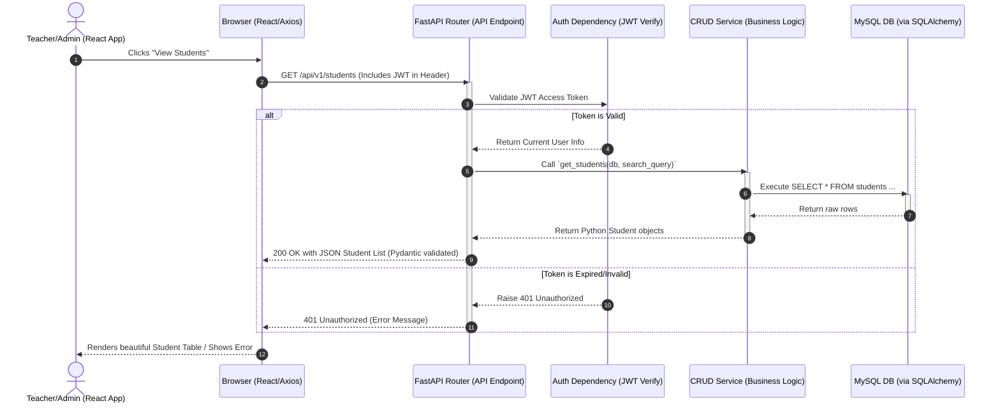
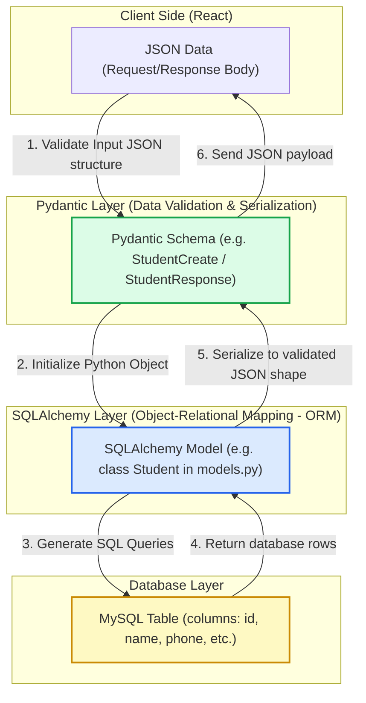
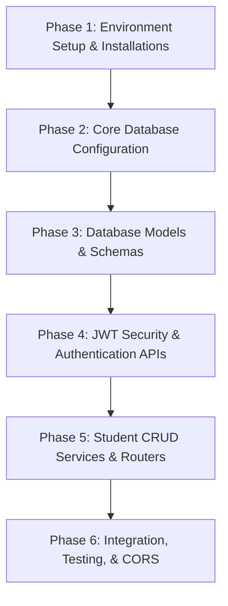

# Tuition Centre / Student Management System (TCMS)
## Backend Architecture & Implementation Plan

Welcome to your full-stack journey! This document acts as your architectural blueprint and step-by-step mentor guide. We will build a production-grade, highly organized **FastAPI** backend integrated with a **MySQL** database using **SQLAlchemy ORM** and secure it with **JWT Authentication**.

Before writing any code, let's understand the complete picture of how the frontend and backend interact, how data flows, and why we design the system this way.

---

## 1. System Interaction Diagrams

### A. The Request/Response Cycle (Frontend $\leftrightarrow$ Backend)
This diagram illustrates the lifetime of an API call. When a React component needs data, it follows this path:



### B. Database Mapping: Pydantic vs SQLAlchemy
One of the most confusing parts for beginners is the difference between **Schemas (Pydantic)** and **Models (SQLAlchemy)**. Here is how they interact and why we need both:



---

## 2. Fundamental Concepts Explained

As a full-stack developer, you must know what happens under the hood. Let's break down these core terms:

| Concept | What it is | Why we need it | Real-world Analogy |
| :--- | :--- | :--- | :--- |
| **Database Model** | A Python class defined using **SQLAlchemy** representing a database table. | It maps Python properties directly to table columns so you don't have to write raw SQL strings (e.g. `SELECT * FROM ...`). | The **blueprint of a physical shelf** where books (data records) are stored. |
| **Schema** | A Python class defined using **Pydantic** that validates incoming data format and shapes outgoing response JSON. | Ensures invalid data (like missing emails or wrong types) is blocked *before* hitting database logic, and formats responses safely. | The **security guard at the door** checking IDs and dress codes before letting people enter. |
| **Router** | A FastAPI mechanism to group and direct incoming web requests based on their URLs and HTTP methods. | Organizes your endpoints logically (e.g. `/students` vs `/teachers`) so your main entry file doesn't get bloated. | A **receptionist** directing visitors to specific rooms based on what they need. |
| **CRUD / Service** | Reusable database functions that create, read, update, or delete records. | Isolates database queries from routers, making your code clean, reusable, and easy to test. | The **librarian** who knows exactly how to search the catalog, pull the book, or add a new one. |
| **JWT Authentication** | A stateless authorization protocol where the server sends a digitally signed token to the client. | Eliminates the need to store session states in the database, allowing high performance, scalability, and secure API requests. | A **VIP wristband** given at the entrance. Show it to access restricted areas; no need to re-verify credentials every time. |

---

## 3. Recommended Backend Folder Structure

To follow industry best practices, we will use a **modular and layered** structure. This is highly scalable and mirrors how big tech projects are designed:

```
tuition-center-backend/
├── app/
│   ├── __init__.py
│   ├── main.py                # App entrypoint (initializes FastAPI, CORS, & includes Routers)
│   ├── core/                  # Core configurations & security setups
│   │   ├── __init__.py
│   │   ├── config.py          # Loads environment variables from .env using Pydantic Settings
│   │   ├── database.py        # Database engine creation and session generator
│   │   └── security.py        # JWT token generation, verification, and password hashing
│   ├── models/                # SQLAlchemy database models (MySQL Tables representation)
│   │   ├── __init__.py
│   │   ├── base.py            # Shared declarative base class
│   │   ├── user.py            # User table model (for logins)
│   │   └── student.py         # Student table model (for registration)
│   ├── schemas/               # Pydantic schemas (Request/Response validators)
│   │   ├── __init__.py
│   │   ├── auth.py            # Login schema & Token models
│   │   └── student.py         # Student CRUD input/output schemas
│   ├── api/                   # Router layer
│   │   ├── __init__.py
│   │   ├── deps.py            # Shared FastAPI dependencies (get_db, get_current_user)
│   │   └── v1/                # API Version 1 endpoints
│   │       ├── __init__.py
│   │       ├── auth.py        # /login and /logout endpoints
│   │       └── students.py    # CRUD endpoints for Students
│   └── crud/                  # Database queries (CRUD / Service layer)
│       ├── __init__.py
│       ├── crud_user.py       # User CRUD operations
│       └── crud_student.py    # Student CRUD operations
├── .env                       # Environment variables (DO NOT commit to git!)
├── .gitignore                 # Excludes venv, pycache, .env, etc. from version control
├── requirements.txt           # Python library dependencies
└── run.py                     # Convenience script to start the development server
```

---

## 4. Phase-by-Phase Roadmap

We will implement this backend systematically, making sure you understand every step before writing the code.



### Phase 1: Environment Setup & Installations
1. Create a `backend` directory alongside the frontend.
2. Initialize a Python virtual environment (`venv`) to keep libraries isolated.
3. Install required libraries: `fastapi`, `uvicorn`, `sqlalchemy`, `pymysql` (MySQL driver), `pydantic-settings`, `python-jose` (for JWT tokens), and `passlib` with `bcrypt` (for password hashing).

### Phase 2: Core Database Configuration
1. Setup a `.env` file to securely store MySQL credentials, Secret Keys, and Token Expiration settings.
2. Write `config.py` using Pydantic Settings to read `.env` with validation.
3. Build `database.py` using SQLAlchemy:
   - Create the engine.
   - Define a `SessionLocal` class for database sessions.
   - Create a dependency function `get_db()` that yields a database session and closes it automatically after each request.

### Phase 3: Database Models & Schemas
1. Create `models/base.py` to establish the declarative base.
2. Build `models/user.py` and `models/student.py` defining SQL schemas.
3. Build matching `schemas/auth.py` and `schemas/student.py` for input/output shapes.

### Phase 4: JWT Security & Authentication APIs
1. Build `core/security.py` with password hashing (`pwd_context.encrypt`, `pwd_context.verify`) and JWT encoding/decoding.
2. Write router `api/v1/auth.py` with:
   - `/login` API (takes email & password $\rightarrow$ generates JWT).
   - `/logout` API (explaining state-free logout).
   - Dependency `/users/me` to get the logged-in user's details.

### Phase 5: Student CRUD Services & Routers
1. Create `crud/crud_student.py` to write functions like `get_student`, `get_students`, `create_student`, `update_student`, and `delete_student`.
2. Create router `api/v1/students.py` wrapping these CRUD actions in secure endpoints.

### Phase 6: Integration, Testing, & CORS
1. Enable CORS middleware in `main.py` so the React application can reach the backend.
2. Boot up the server and interact with the **Interactive API Documentation** (FastAPI Swagger at `/docs`).
3. Connect React pages using `fetch` or `Axios` to complete full-stack integration!

---

> [!NOTE]
> Let's discuss this architecture first. Once you review and approve this design, we will proceed to **Phase 1: Project Setup and Installations**! 
> If you have any questions about these structures, ask them now. I'm here to guide you step-by-step!
